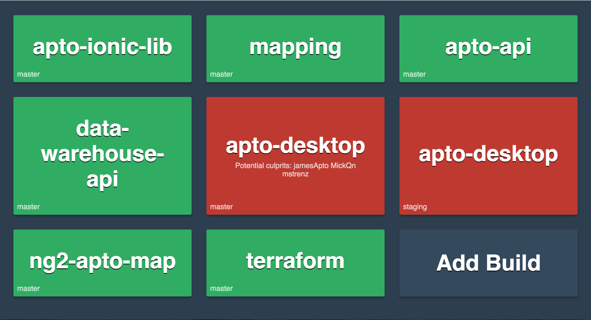

# circle-build-health

> A dashboard for the status of your builds in CircleCI



## How to run

[](https://heroku.com/deploy?env[RAZZLE_USE_AUTH0]=false)

### Production
```
yarn start:prod
```

### Development
```
yarn start
```

### Environment Variables

This project uses [razzle](https://github.com/jaredpalmer/razzle), which means it uses its [awesome tooling around .env files](https://github.com/jaredpalmer/razzle#what-other-env-files-are-can-be-used). Here's [the latest documentation](https://github.com/jaredpalmer/razzle#environment-variables) on the environment variables supported via razzle.

#### Required environment variables
**RAZZLE_USE_AUTH0** - a "boolean" indicator to have auth needed prior to seeing the status of the build lights.

**RAZZLE_CIRCLE_CI_TOKEN** - a string that is used to talk to your personal circleci to get a list of projects you follow and see their build statuses.

#### Required if you are using Auth0
**RAZZLE_AUTH0_DOMAIN** - Your auth0 domain

**RAZZLE_AUTH0_CLIENTID** - Your auth0 client id

**RAZZLE_AUTH0_CLIENTSECRET** - Your Auth0 client secret

**RAZZLE_AUTH0_CALLBACK** - Your Auth0 callback url